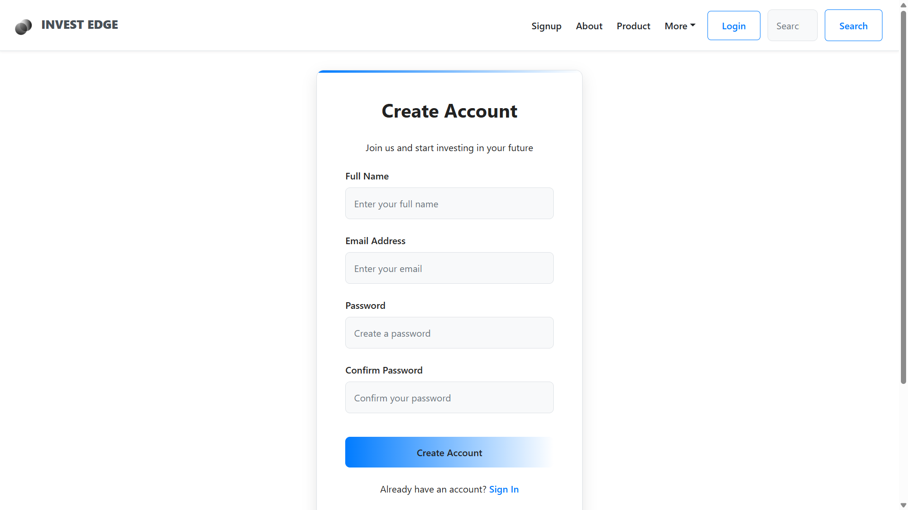
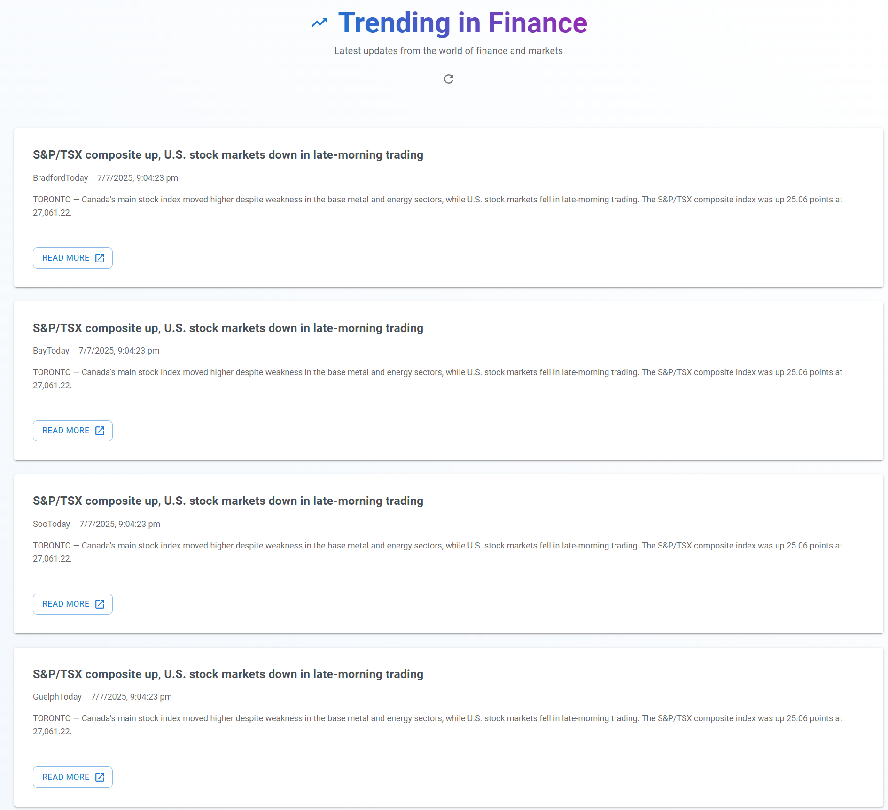
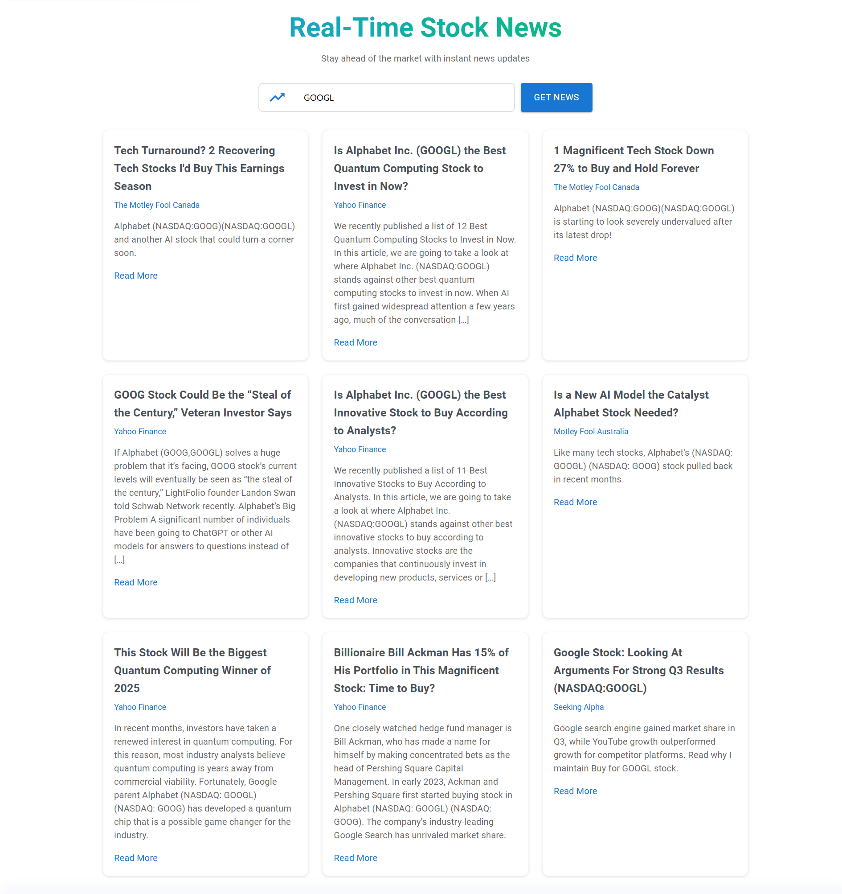
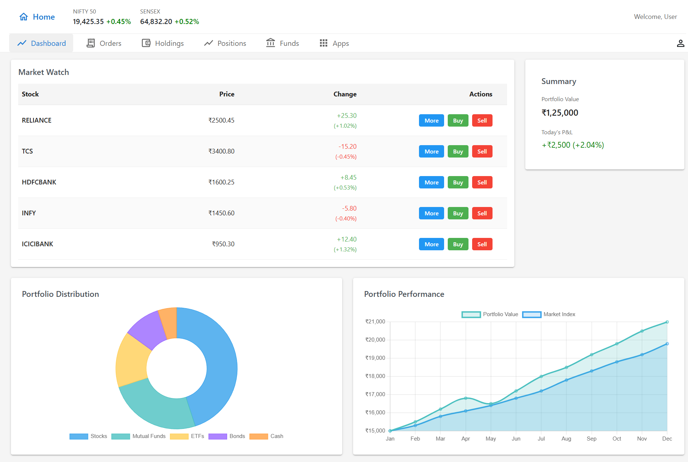
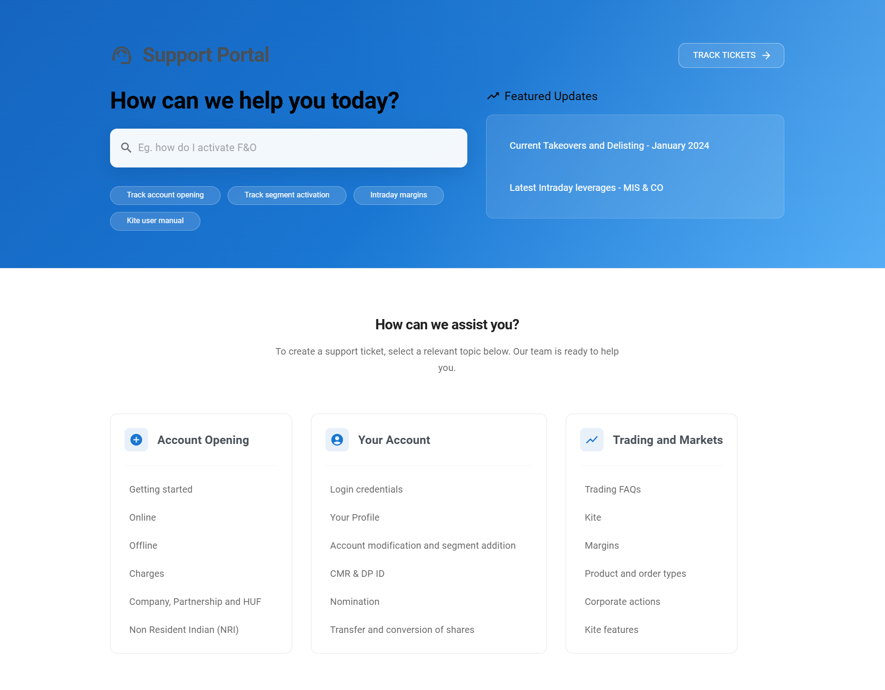
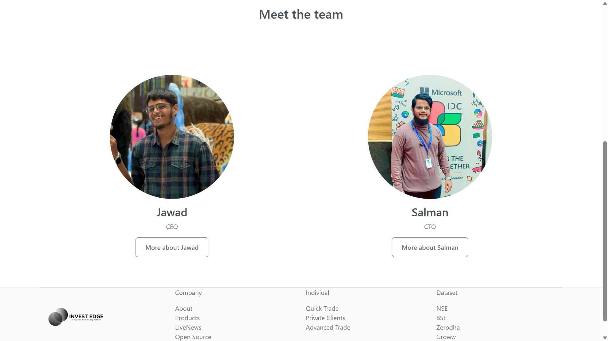

# 💹 InvestEdge – AI-Enhanced Stock Trading Platform

InvestEdge is a next-generation web application designed to make stock trading smarter, more accessible, and user-friendly. Built with the MERN stack, it integrates AI-powered insights, real-time market data, and a clean dashboard to help users invest with confidence.

## 🚀 Live Demo
🔗 [Check it out here](https://lnkd.in/gZAycKNz)

---

## 📌 Features

- 🔐 **User Authentication** – Secure sign-up/login with JWT-based authentication.
- 📈 **Live Dashboard** – Real-time stock watchlist, market performance, and instant buy/sell actions.
- 📊 **Portfolio Analytics** – Visual insights with pie charts and graphs for portfolio distribution and growth tracking.
- 📰 **Real-Time News Feed** – Live financial news and stock-related headlines.
- 🌍 **Trending Finance** – Global economic updates and stock market movements.
- 💬 **Support Portal** – Interactive help section for user queries and ticket tracking.
- 🎨 **Responsive UI/UX** – Clean, intuitive design powered by Tailwind CSS.

---

## 🛠️ Tech Stack

| Frontend       | Backend        | Database  | Other Tools        |
|----------------|----------------|-----------|--------------------|
| React.js       | Node.js        | MongoDB   | Tailwind CSS       |
| Chart.js       | Express.js     | Mongoose  | RESTful APIs       |
| Axios          | JWT Auth       |           | News APIs, Stock APIs |

---

## 👥 Team

| Name  | Role                |
|-------|---------------------|
| Jawad | CEO, Frontend Lead  |
| Salman| CTO, Backend Lead   |

---

## 📸 Pages & Modules

- **Home Page:** Introduction to the platform with a direct sign-up CTA.
- **Signup/Login:** Secure access flow for users.
- **Dashboard:** Stock watchlist, portfolio value, distribution, and performance tracking.
- **Live News:** AI-curated financial headlines from top sources.
- **Trending Finance:** Global stock trends and macro news.
- **Support Portal:** Query search, categorized help, and ticket system.
- **About Page:** Meet the team behind the project.

---

🖼️ Screenshots
<h3 align="center">Home Page</h3>
<p align="center">
  
</p>

<h3 align="center">Sign Up Page</h3>
<p align="center">
  
</p>

<h3 align="center">Trending News Page</h3>
<p align="center">
  
</p>

<h3 align="center">Real Time Stock News</h3>
<p align="center">
  
</p>

<h3 align="center">Dashboard</h3>
<p align="center">
  
</p>

<h3 align="center">Support Page</h3>
<p align="center">
  
</p>

<h3 align="center">About Page</h3>
<p align="center">
  
</p>

---

## 📈 Future Updates

✅ Advanced stock prediction using ML models  
✅ Personalized investment recommendations  
✅ Alerts & notifications system  
✅ Full mobile responsiveness  
✅ Integration with trading APIs (Zerodha, Groww)

---

## 🧪 Setup Instructions

1. **Clone the repository**
   ```bash
   git clone https://github.com/your-username/investedge.git
   cd investedge

 2. **Install dependencies**
```
cd client   # React frontend
npm install

cd ../server   # Node backend
npm install
```
---
3. **Configure Environment Variables**
##### Create a .env file in the server directory with your MongoDB URI, JWT secret, etc.

---
4. **Start the development servers**
```
    cd server
    npm run dev

    cd ../client
    npm start
```
---
📬 Contact

Feel free to connect or contribute:

  LinkedIn – [Jawad Mohammed](https://www.linkedin.com/in/jawad-mohammed-86b306241/)

  LinkedIn – [Mohammed Salman](https://www.linkedin.com/in/salman-mohammed-a946a3220/)

---
⭐ Contributions Welcome!

Found a bug? Have an idea for a feature?
Open an issue or submit a pull request – we’d love to collaborate with the community!

---
📄 License

This project is licensed under the MIT License.


